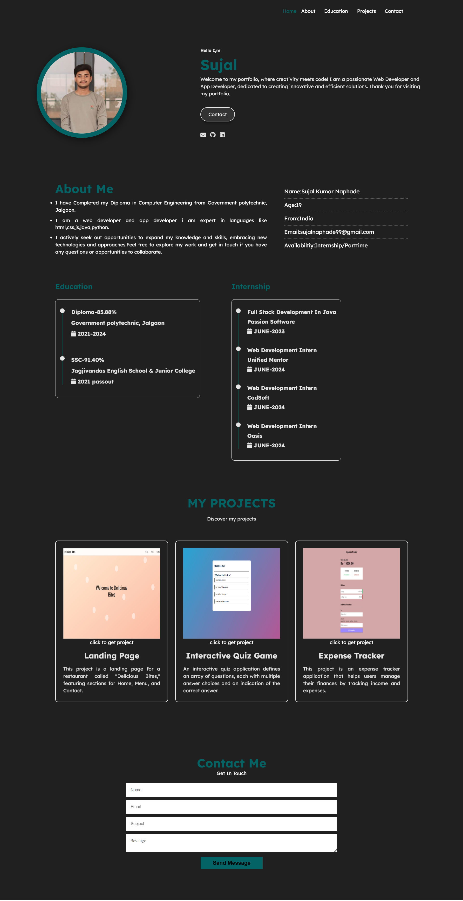

 ## Description

This project is a personal portfolio website designed to showcase the work and skills of a web and app developer. It features a fixed navigation bar with smooth scrolling, sections for Home, About, Education, Projects, and Contact. The home section includes a profile photo, introduction, and social media links. The education and internship sections list academic achievements and work experience, while the projects section displays completed projects with descriptions and links. The contact section includes a form for visitors to get in touch.

# Screenshots

## Features
- Fixed navigation bar with responsive menu
- Smooth scrolling for navigation
- Home section with profile photo, introduction, and social media links
- Animated typing effect for profile text (using Typed.js)
- Interactive elements with hover effects (buttons, links)
- About section with detailed personal information and skills
- Education timeline with visual indicators
- Internship timeline with visual indicators
- Project section with images, descriptions, and clickable links
- ScrollReveal animations for sections and elements
- Responsive design for mobile and desktop views

## Author

Sujal Naphade

